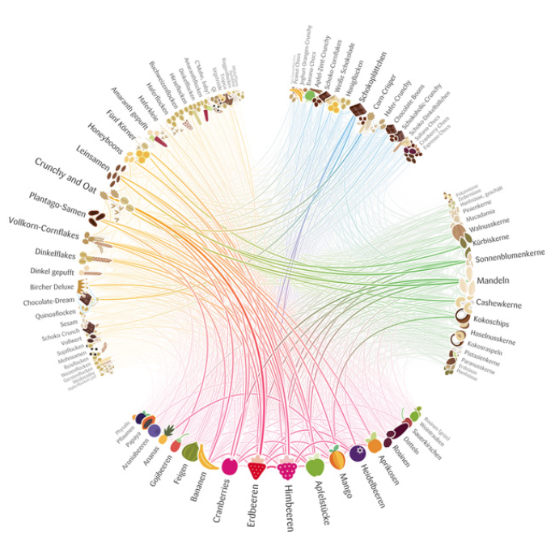

*CircularGraph*
================
**Circular visualizations for connectivity matrices**

In the field of Neuroimaging, connectivity matrices are used to describe 
the manner by which different brain regions (nodes) are connected (by edges) to other brain regions.

There are many ways to visualize these connectivity matrices, and in this project we'll create a platform 
for a circular visualization of them, which is not easily available in python at the moment.

In a circular visualization of graphs, the nodes (= brain regions) are spread throughout the circumference of a circle,
and strings connecting them are used to describe the edges (see figure above).

In this project, you're asked to create a platform to load a tabular connectivity matrix (i.e, n x n matrix, in which n in the number of nodes),
with an associated parcellation atlas (i.e, a table describing the properties of brain regions described in the matrix),
and create a circular graph the describes it.

While we'll leave it for you to decide how to create this platform, here are some parts that should probably be in this project:

1. Some data reader that recieves a path to a connectivity matrix and the corresponding parcellation scheme's properties.
   I've added such a files so you'll have something to work with (under `data/examples`).
   The data reader should read these files and rearange the information in a format of your choice.
2. Another module that will recieve the information stored in the connectivity matrix in the abovementioned format.
   This module will then create the circular layout of the graph - it will:

   - Spread the nodes according to some label describing them across the circumference of the circle.
   - Create the links between these nodes.

   This module should be as flexible as possible - 

   - It should allow the naming of the nodes to be decided according to which ever column in the parcellation scheme the user will choose.
   - It should allow the thresholding of the edges according to a value of the user's choice.
  
3. Colors.
   As this project aims to be... beautiful, there should be a notable focus on the color schemes the will be used to color the edges and nodes in the graph.
   There should be a possibility to color the edges according to some association of the nodes.
   For example - giving all edges associated with a certain lobe the same color.
   Here's where you get creative!

.. image:: data/images/imagination.jpeg
    :width: 400
    :align: center
    :alt: imagination

(P.S, I've added a MATLAB code the some of Yaniv's lab members use for such visualizations, feel free to draw some inspiration from it)

P.S #2:

Since circular graphs are so beautiful, we won't be the first to try implementing them as a python package,
which means that you can draw even more inspiration from other open-source packages such as:

- `mne`_
- `networkx`_
- `nxviz`_

And many more... (I'll leave some exlorations for you to do)

.. _mne: https://mne.tools/stable/generated/mne.viz.circular_layout.html
.. _networkx: https://networkx.org/documentation/stable/reference/generated/networkx.drawing.layout.circular_layout.html
.. _nxviz: https://nxviz.readthedocs.io/en/latest/usage.html#circos-plots